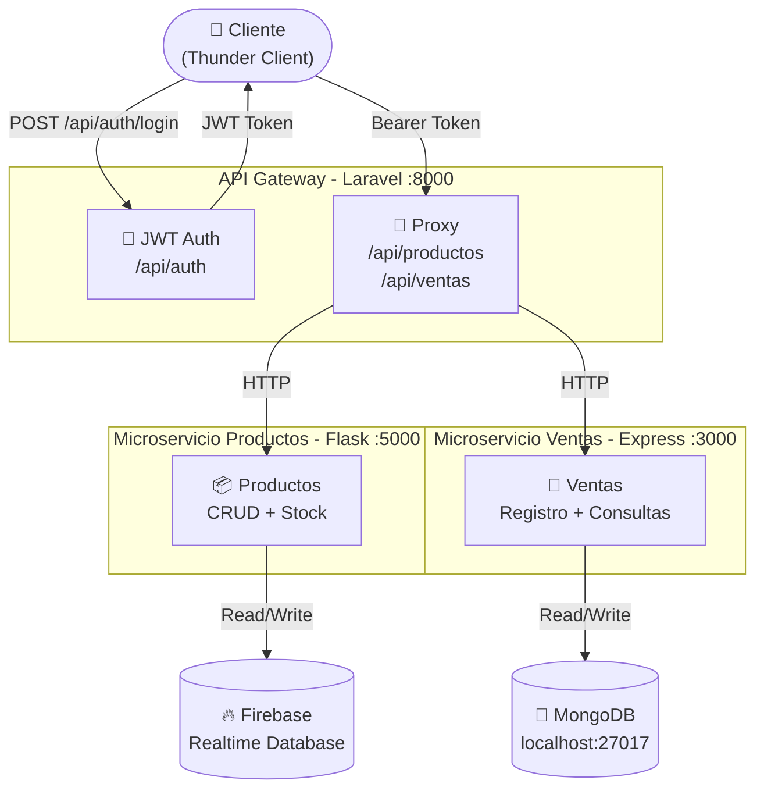

# Sistema de Ventas con Microservicios

## Descripción
Sistema de ventas construido con arquitectura de microservicios.
Desarrollado para el Taller clase 11 de marzo - Ingeniería de Software 2.

## Arquitectura
```
Cliente (Thunder Client)
        │
        ▼
┌───────────────────┐
│   API Gateway     │  Puerto 8000 - Laravel
│   JWT Auth        │
└────────┬──────────┘
         │
    ┌────┴────┐
    │         │
    ▼         ▼
┌───────┐ ┌───────┐
│Flask  │ │Express│
│:5000  │ │:3000  │
│       │ │       │
│Firebase│ │MongoDB│
└───────┘ └───────┘
```

## Tecnologías
| Servicio | Tecnología | Base de datos | Puerto |
|----------|------------|---------------|--------|
| API Gateway | Laravel 12 | SQLite | 8000 |
| Microservicio Productos | Flask (Python) | Firebase Realtime DB | 5000 |
| Microservicio Ventas | Express (Node.js) | MongoDB | 3000 |

##  Archivos requeridos (enviados por separado)
Los siguientes archivos no están en el repositorio por seguridad.
Deben colocarse en sus carpetas correspondientes antes de correr el proyecto:

| Archivo | Carpeta destino |
|---------|-----------------|
| `firebase-key.json` | `microservicio-productos/` |
| `.env` | `microservicio-productos/` |
| `.env` | `microservicio-ventas/` |
| `.env` | `api-gateway/` |

## Instalación y ejecución

### Requisitos previos
- PHP 8.1+
- Composer
- Python 3.10+
- Node.js 18+
- MongoDB corriendo en localhost:27017

### 1. Clonar el repositorio
```bash
git clone https://github.com/diego-col-un/taller-microservicios.git
cd taller-microservicios
```

### 2. Microservicio Productos (Flask) — Puerto 5000
```bash
cd microservicio-productos

# Crear entorno virtual
python -m venv venv

# Activar entorno virtual
# Windows PowerShell:
venv\Scripts\activate
# Git Bash:
source venv/Scripts/activate

# Instalar dependencias
pip install -r requirements.txt

# Correr servidor
python app.py
```

### 3. Microservicio Ventas (Express) — Puerto 3000
```bash
cd microservicio-ventas

# Instalar dependencias
npm install

# Verificar MongoDB (PowerShell)
Get-Service -Name MongoDB
# Si dice Stopped:
Start-Service -Name MongoDB

# Correr servidor
node index.js
```

### 4. API Gateway (Laravel) — Puerto 8000
```bash
cd api-gateway

# Instalar dependencias
composer install

# Generar clave de aplicación
php artisan key:generate

# Correr migraciones
php artisan migrate

# Correr servidor
php artisan serve
```

## Flujo de una venta
1. Cliente hace login → `POST /api/auth/login` → recibe JWT
2. Con el JWT consulta productos → `GET /api/productos/`
3. Verifica stock del producto → `GET /api/productos/:id`
4. Registra la venta → `POST /api/ventas/`
5. Gateway descuenta el stock → `PUT /api/productos/:id/stock`

## Endpoints disponibles

### Autenticación
| Método | Endpoint | Descripción | Auth |
|--------|----------|-------------|------|
| POST | /api/auth/register | Registrar usuario | No |
| POST | /api/auth/login | Iniciar sesión | No |
| POST | /api/auth/logout | Cerrar sesión | Si |
| GET | /api/auth/me | Usuario actual | Si |

### Productos (Flask via Gateway)
| Método | Endpoint | Descripción | Auth |
|--------|----------|-------------|------|
| GET | /api/productos/ | Listar productos | Si |
| GET | /api/productos/:id | Obtener producto | Si |
| POST | /api/productos/ | Crear producto | Si |
| PUT | /api/productos/:id/stock | Actualizar stock | Si |
| DELETE | /api/productos/:id | Eliminar producto | Si |

### Ventas (Express via Gateway)
| Método | Endpoint | Descripción | Auth |
|--------|----------|-------------|------|
| GET | /api/ventas/ | Listar ventas | Si |
| GET | /api/ventas/usuario/:id | Ventas por usuario | Si |
| GET | /api/ventas/fecha/:fecha | Ventas por fecha | Si |
| POST | /api/ventas/ | Registrar venta | Si |

## Ejemplos de prueba con Thunder Client

### Login
```
POST http://localhost:8000/api/auth/login
Body: { "email": "diego@test.com", "password": "123456" }
```

### Crear producto
```
POST http://localhost:8000/api/productos/
Authorization: Bearer TU_TOKEN
Body: { "nombre": "Camisa", "precio": 35000, "stock": 10 }
```

### Registrar venta
```
POST http://localhost:8000/api/ventas/
Authorization: Bearer TU_TOKEN
Body: { "usuario_id": "1", "producto_id": "ID_FIREBASE", "cantidad": 2, "total": 70000 }
```
## Diagrama del sistema
